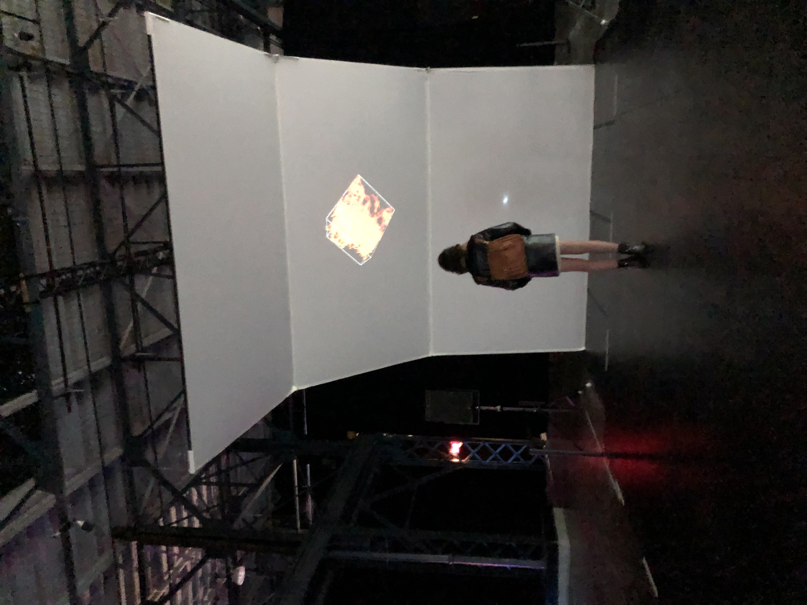
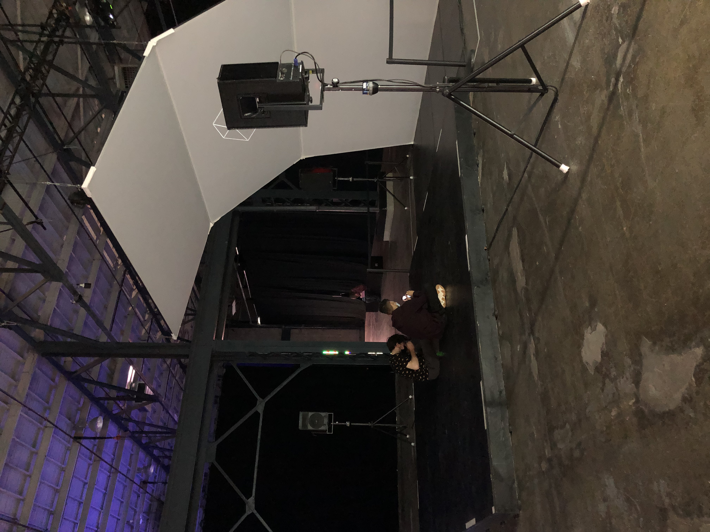
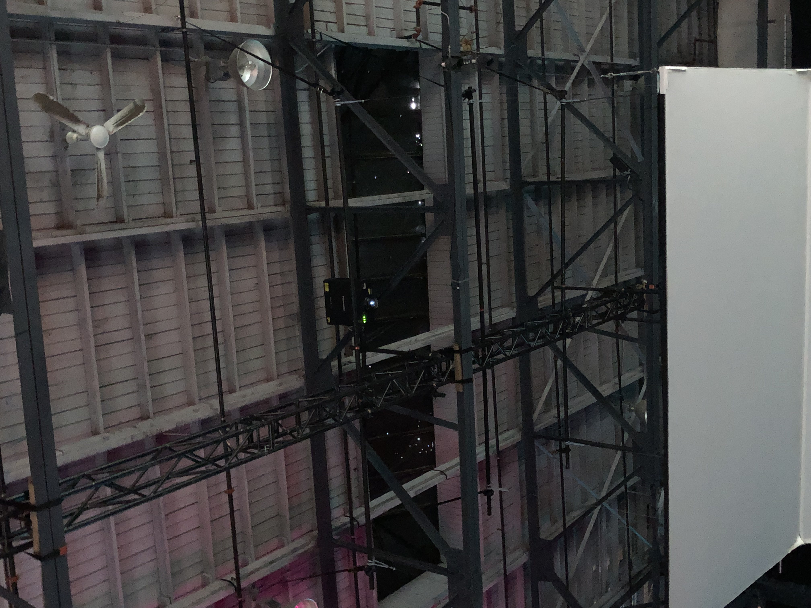
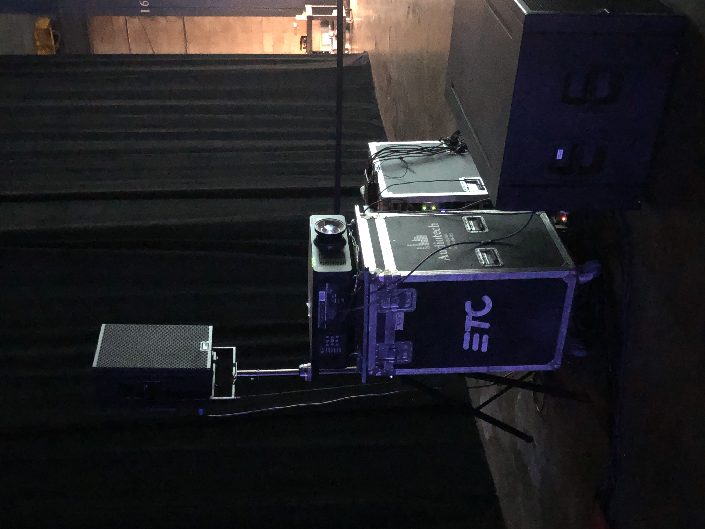
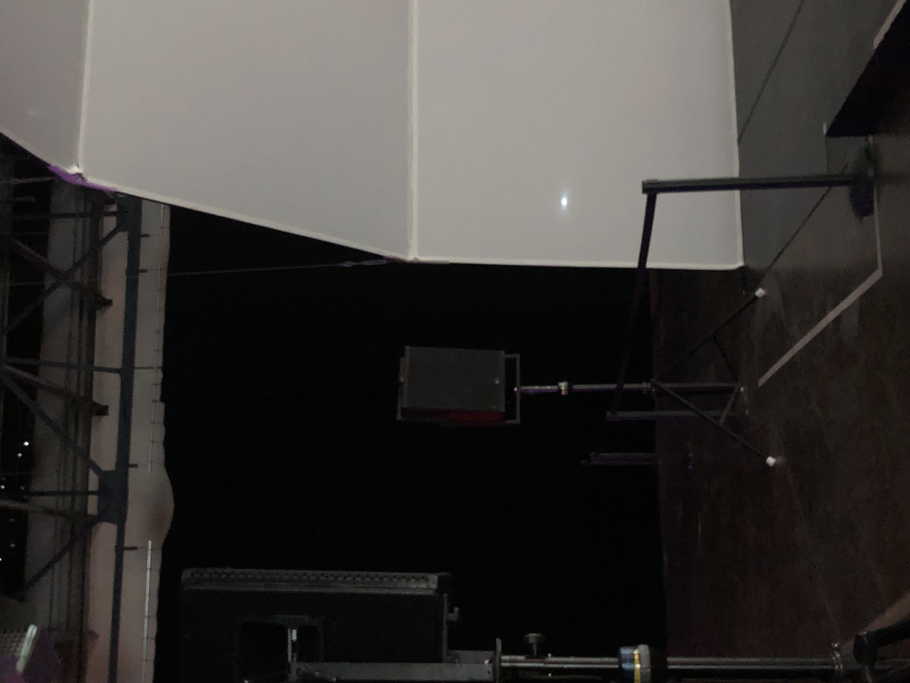
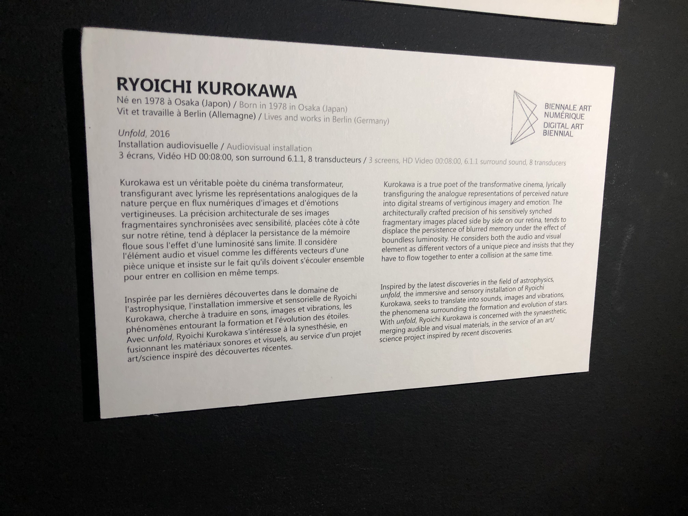
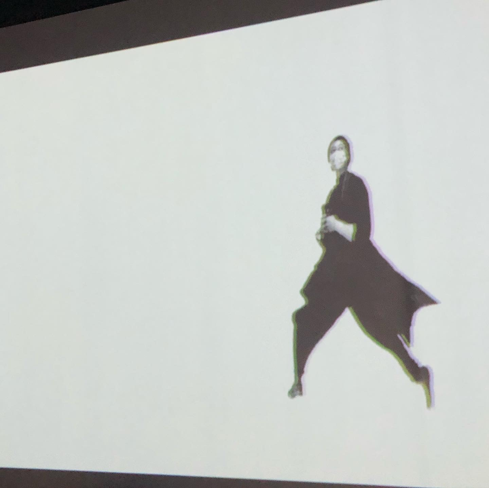

## TITRE DE L'OEUVRE
- Unfold
 
### NOM ARTISTE OU FIRME
- Ryoichi Kurokawa

### ANNÉE DE RÉALISATION
- 2016

### NOM DE L'EXPOSITION OU DE L'ÉVÉNEMENT
- Elektra: 5e Biennale Internationale d'Art Numérique

### LIEU DE MISE EN EXPOSITION
- Arsenal Art Contemporain

### DATE DE VOTRE VISITE 
 - 10 février 2022

## DESCRIPTION
 - Représentation imagée et sonorisée de la naissance d'une étoile étendu sur trois écrans.

### EXPLICATIONS
- Cet oeuvre multimédia immersive est composée de trois écrans qui archent au-dessus du visiteurs. Sur ces écrans ils y un représentation imagée de la naissance d'une étoile. Devant la diffusion, sous les pieds des spectateurs il se trouve une plateforme légerement surélevé qui est munis d'engins qui fait vibrer la plateforme en accordance avec les images et les sons de ce qui est présenté. En plus de tout cela, l'oeuvre est dotée de multiples haut-parleurs qui sert à créer et augmenter l'expérience immersive.

### LISTE DES COMPOSANTES ET TECHNIQUES
 - 3 projecteurs
 - 5 haut-parleurs
 - Plateforme vibrante
 - 3 écrans blancs pour accueillir la projection
 

### LISTE DES ÉLÉMENTS NÉCESSAIRES
 - Plateforme en bois pour cacher les méchanismes de vibration (subwoofer)
 - 5 supports/trépieds à haut-parleurs (pour les surélevés)
 - Cache-fils
 - Grillage de soutien pour tenir les projecteurs mis en hauteur

## EXPÉRIENCE VÉCUE

**DESCRIPTION DE VOTRE EXPÉRIENCE**
 - Lorsque je suis entré dans la salle d'exposition, c'est cette oeuvre qui a attiré mon regard en premier, elle est imposante et impréssionante. C'était facile de reconnaitre son type d'oeuvre, c'est-a-dire, immersif. En tout, j'ai trouver mon expérience plaisante car j'ai pu me perdre dans l'univers que cette oeuvre partageait. J'ai beaucoup aimé le fait que la projection était en forme d'arc, et que l'on se sentait recouvert par les projections. J'ai aussi trouvé que la composition sonore et les vibrations étaient bien synchronisés avec le visuel. 

 ❤️ **CE QUI VOUS A PLU**
- J'ai aimé l'unité que tous les éléments réunis formaient. C'est quelque chose que j'aimerais recréer dans un de mes futurs projets.
- L'effet sensoriel de l'oeuvre (les vibrations) était un élément assez innovatif à mon avis, c'était une belle touche.
- La composition visuelle avec les images qui défilaient rapidement ou lentement dans différents moments. C'était une belle juxtaposition de rythme, ça l'apportait à l'expérience différentes émotions.

 🤔 **ASPECT QUE VOUS SOUHAITERIEZ PAS RETENIR**
 - Le son était un peu fort, c'était un déstabilisant par moment. Il est facile de se dire que pour être immersif tout doit être fort en expérience mais je crois qu'il est plus impressionant lorsqu'une immersion est atteint par autre moyen qu'un bombardement sensoriel. Donc, dans mes futurs projets j'aimerais offrir des moments de subtilité plutôt que une longue chaîne d'intensité.
 - Je n'ai pas aimé l'endroit où l'oeuvre était placé, cela enlevait aux facteurs immersifs. Alors, hypothétiquement si jamais j'ai une créations à exposer je serais catégorique sur l'endroit et la façon dont mon oeuvre devrais être exposée.

## RÉFÉRENCES

**Photographies et croquis à intégrer**

 - Oeuvre dans son ensemble 
  
 - Composantes de l'oeuvre
  
  Éléments nécessaires à sa mise en espace
  
  
  
 - Photographie du cartel 
  
 - Autoportrait avec l'oeuvre (j'ai oublier d'en prendre une avec cet oeuvre mais en voici une avec un autre oeuvre oops...)
  
 - Croquis de la mise en espace
  
 - Vidéo de l'oeuvre
 - 

