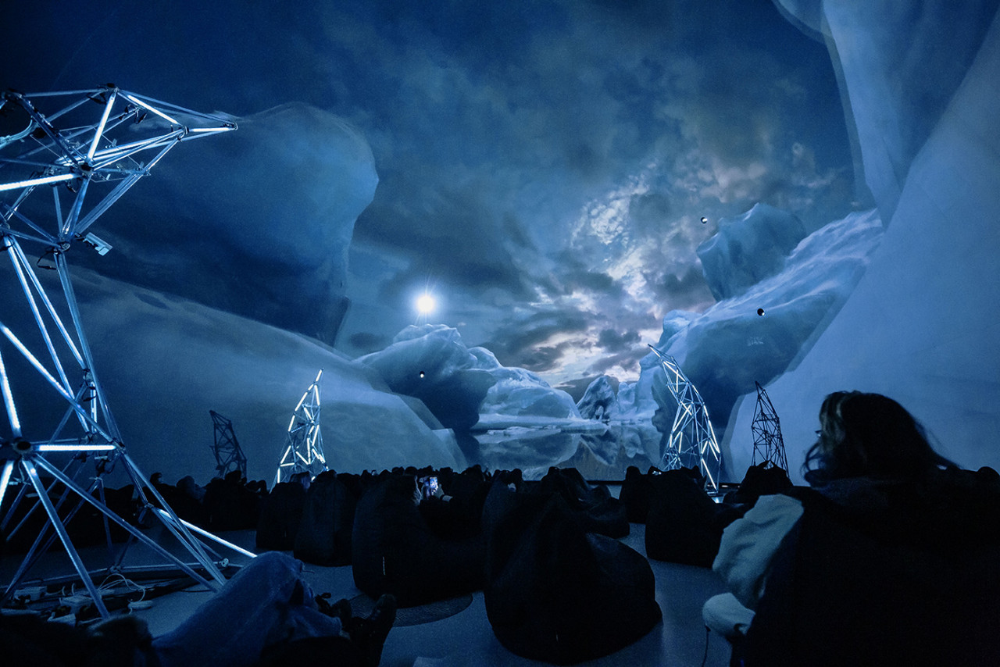
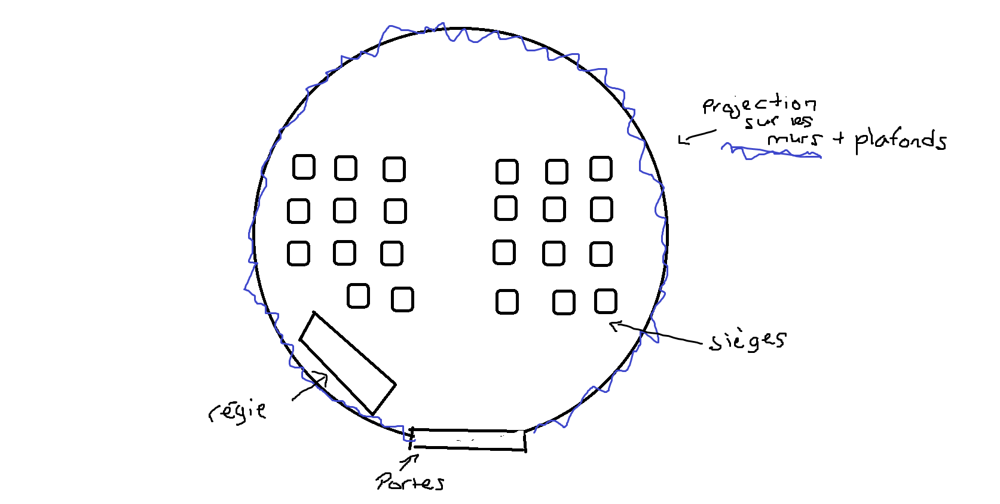
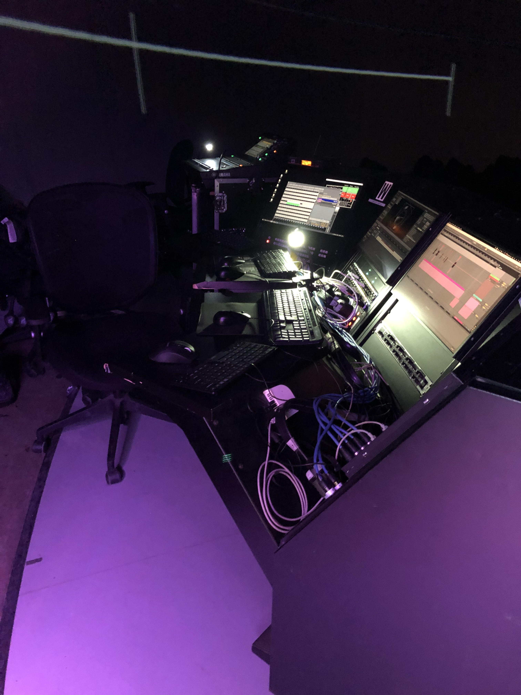
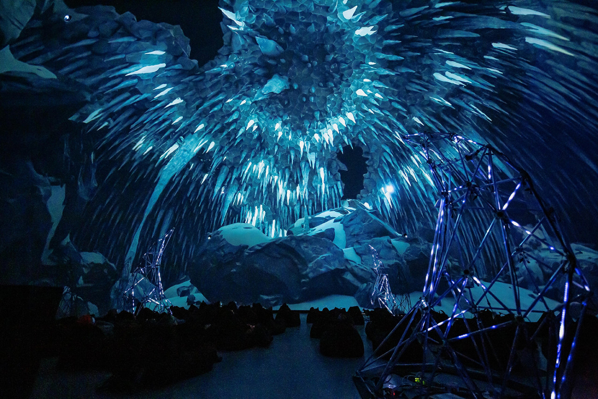
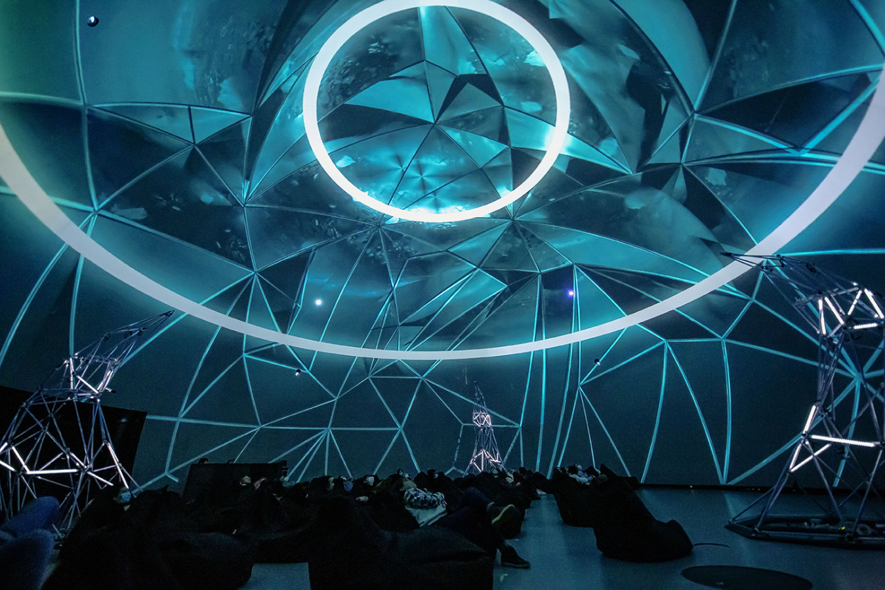
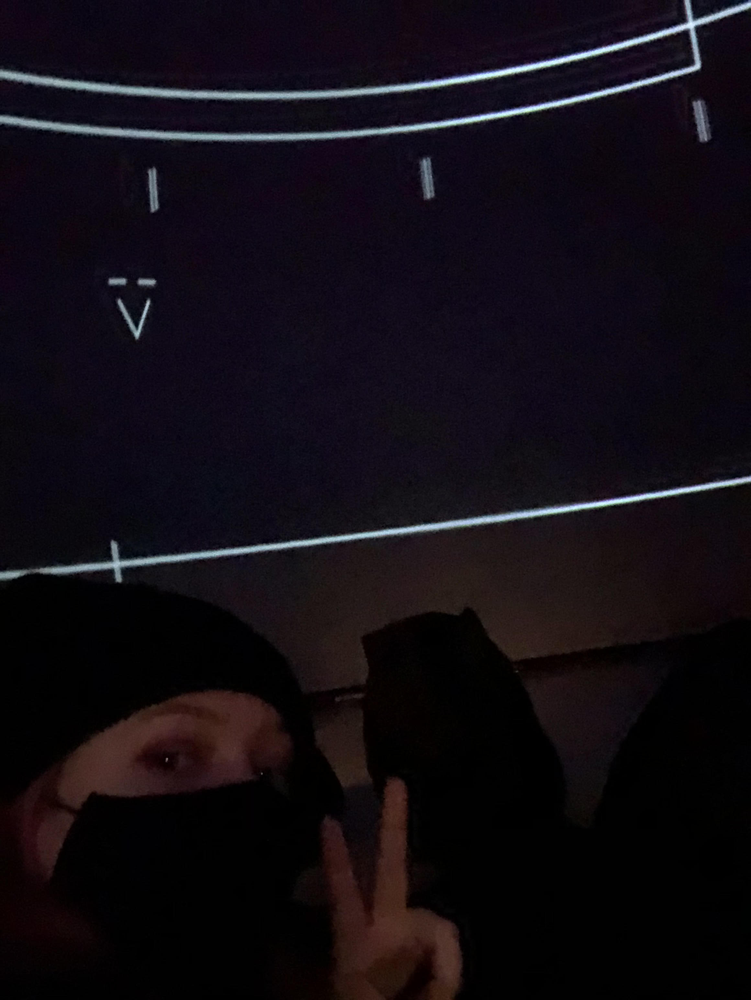

## TITRE DE L'OEUVRE
- 22.7°C 
 
### NOM ARTISTE OU FIRME
- MOLECULE
- Dirty Monitor

### ANNÉE DE RÉALISATION
- 2022

### LIEU DE MISE EN EXPOSITION
- La satosphère à la Société des Arts Technologies de Montréal.

### DATE DE VOTRE VISITE 
 - 3 mars 2022

## DESCRIPTION
 -22.7C est une collaboration entre Molécule, un artiste qui se spécifie en musique électronique, et Dirty Monitor, un studio de création 3D et de mapping/projection vidéo. Le thème de l'oeuvre tourne autour de l'album -22.7C créé par Molécule. Dans cet album, il tente de représenter son expérience au Groenland, donc dans le cercle polaire. Pour ce faire, il a séjourné dans une petite ville du Groenland ou il a pris des extrais sonores des banquises et autres éléments de la nature environnante pour créer ses pistes. Alors, l'oeuvre se résume en étant une projection visuel au rhytme de cet album, la projection se donnait en 360 sur les murs de la satosphère.
 
   
 (source: https://sat.qc.ca/fr/molecule-22-7)
 
### EXPLICATIONS
Comme mentionné ci-dessus, cet oeuvre à été présenté dans la satosphère, qui est une structure en forme de dome fait pour l'exposition d'oeuvre artistique. Le dome à un diamètre de 18 mètres et une hauteur de 13 mètres. Le théâtre est doté de 8 projecteurs vidéos, 157 hauts-parleurs ainsi que des écrans modulaires qui ont l'avantage d'avoir un angle d'exposition changeante (soit 180°, 210°, 230° et 360°) ce qui offre l'opportunité aux artistes de projeter une oeuvre qui englobe complètement le spectateur. Peu importe la direction que l'on regarde, il y a de la projection. Donc, cela crée une expérience extrêmement immersive.

    

### LISTE DES COMPOSANTES ET TECHNIQUES
 - Projecteurs/Mapping
 - Conception Sonore
 - Modélisation 3D

### LISTE DES ÉLÉMENTS NÉCESSAIRES
 - 8 projecteurs vidéos
 - 157 hauts-parleurs
 - Écrans modulaires (angles adjustable)
 - Centre de contrôle (régie)  
  

## EXPÉRIENCE VÉCUE

**DESCRIPTION DE MON EXPÉRIENCE**
- Une fois rentré dans la satosphère sur le sol il y avait des sièges coussinés, comme des poufs, qui invitait le spectateur à s'asseoir et à se mettre comfortable. Il y avait un technicien qui s'occupait de faire partir le spectacle il était dans la salle lui-aussi derrière une table de régie. Le présentation durait environ 45 minutes.

- Une fois le spectacle commencé, ont à été présenté à des scènes modélisé en 3D qui représentait les paysages du cercle polaire, donc des glaciers et des éléments de la faune de l'antartique. Il y avait aussi du visuel abstrait qui voyageaient au rythme de la musique. L'aspect sonore et visuel était intrisiquement relié, lorsque la trame sonore avait un rythme rapide, les scènes projetées gagnaient en cadence aussi. En bref, les scènes présenté avaient une qualité hypnotisante.

   
 (source: https://sat.qc.ca/fr/molecule-22-7)

❤️ **CE QUI M'A PLU**
- J'ai vraiment aimé mon expérience c'était très apaisant la qualité de la musique et du visuel était phénoménale. L'ambiance et la mise en exposition était propice à une expérience complètement immersive. J'ai adoré aussi le concept d'explorer diverses paysages en projection 3D et l'harmonie créé entre la musique et les rendus. 
-
   
 (source: https://sat.qc.ca/fr/molecule-22-7)

 🤔 **ASPECT QUE JE NE SOUHAITE PAS RETENIR**
 - Par contre, j'ai trouvé qu'à certains moments du spectacle le visuel était trop intense, les images stroboscopiques donnait un peu mal à la tête vu qu'il nous englobait complètement alors quand il y avait des scènes clignotantes, c'était un peu envahissant. Malgré ce fait, j'ai pu déconnecter de la réalité et m'immerser à fond dans cette oeuvre multimédia ce qui m'a offert un bon 45 minutes de sérénité.
   
 (source: https://sat.qc.ca/fr/molecule-22-7)
  
 
 ## SELFIE
  

