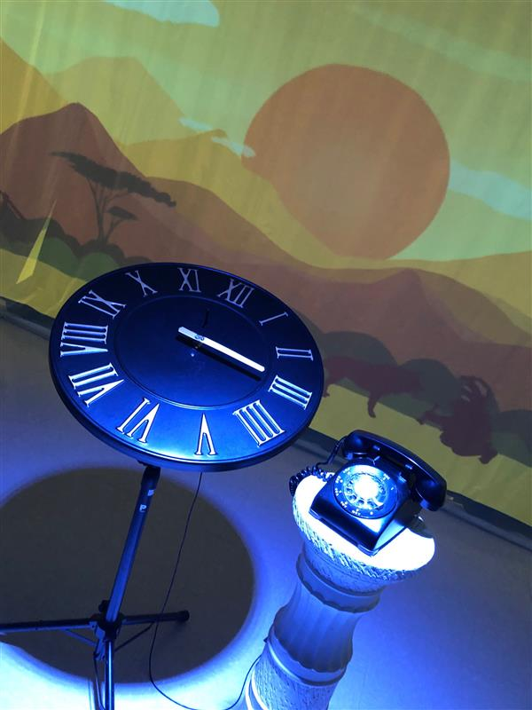
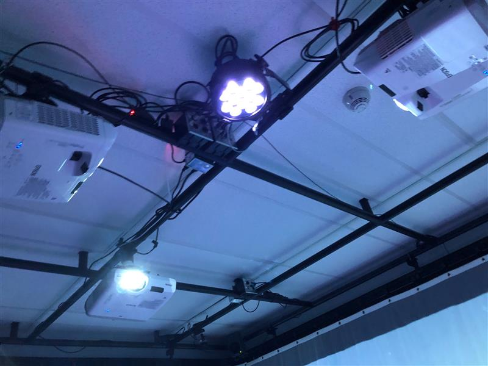

## TITRE DE L'OEUVRE
- L'horloge de l'apocalypse
 
### NOM ARTISTE OU FIRME
- Maxime Sabourin
- Louis-Philippe Gravel
- Alexis Lacasse
- Tristan Girard-Montpetit
- Maxime De Falco

### ANNÉE DE RÉALISATION
- 2022

### NOM DE L'EXPOSITION OU DE L'ÉVÉNEMENT
- MOEBIUS

### LIEU DE MISE EN EXPOSITION
- Petit studio au Collège Montmorency

### DATE DE VOTRE VISITE 
 - 24 mars 2022

## DESCRIPTION
 - L’horloge de l’apocalypse représente la ligne du temps de l’humanité. Selon le concept de l’horloge, il est présentement 11 h 58 et il reste 2 minutes avant la fin de l’humanité. À travers ce projet, l’interacteur est invité à contrôler l’horloge grâce aux aiguilles et ainsi manipuler la ligne du temps. Au cours de l’expérience, vous pourrez vivre les différentes époques auxquelles la terre a été exposée. Vous serez exposé aux différents enjeux actuels à travers la projection qui vous entourera et par le fait même vous plongera dans une immersion totale  
 (source: https://tim-montmorency.com/2022/projets/L-horloge-de-l-apocalypse/docs/web/index.html)
  
 
### EXPLICATIONS
- L'oeuvre était exposée dans le petit studio, au milieu de la pièce il y avait une grande horloge et à côté de celle-ci, il avait une colonne avec un téléphone dessus. Sur les murs, il avait des rideaux qui servait de surface de projection. Les aiguilles de l'horloge était intéractives du fait que lorsque le visiteur tournait celle-ci la scène en projection changeait, la trame sonore aussi. À la fin le téléphone sonne pour indiquer que l'apocalypse est imminente.   

### LISTE DES COMPOSANTES ET TECHNIQUES
 - Projecteurs
 - Conception Sonore
 - Programmation
 - Animation 2D

### LISTE DES ÉLÉMENTS NÉCESSAIRES
 - Câbles de connection
 - Poles de soutiens
 - Haut-parleurs
 - Kinect
 - Projecteurs (lumières)
 - Raspberry Pi  
  

## EXPÉRIENCE VÉCUE

**DESCRIPTION DE MON EXPÉRIENCE**
- J'ai trouvé l'expérience plaisante, c'était inspirant de voir tout l'effort mis dans ce projet. J'ai aussi apprécié le message de l'oeuvre. C'est un message très important et ils l'ont bien traduit. Il on bien montré l'urgence de la situation envrionnementale. 

 ❤️ **CE QUI M'A PLU**
- J'ai beaucoup aimé les trames sonores, les variations qui s'harmonisaients avec les différentes scènes. C'était une belle synchronocité que j'aimerais être capable de récréer dans mes futurs projets.
- J'ai aimé le halo de lumière qui était projeté sur l'élément clé de la pièce (l'horloge), c'est une bonne méthode pour capter l'attention.

 🤔 **ASPECT QUE JE NE SOUHAITE PAS RETENIR**
 - J'ai moins aimé le fait que lorsque le téléphone sonnait, une fois répondu le message à l'autre bout de la ligne jouait qu'une seule fois. Alors, si on est plusieurs dans la pièce à vivre l'expérience seulement une des personne à l'opportunité d'entendre le message. Ça serait peut-être intéressant de faire répeter le messages plusieurs fois. C'est plus immersifs ainsi. 

## ORDRE DE PRÉFÉRENCE ACTUEL
1. Chère Sasha: J'ai adoré tous les éléments et l'attention au détail de cette oeuvre, l'intéractivité entre les objets et le public à rendu l'expérience très immersives. D'ailleurs, c'était facile de s'immiscer dans la vie du personnage de Sasha, de comprendre ce qu'elle pouvait vivre. J'ai aussi aimé le réalisme dans la disposition des éléments/des décors on aurait dit une vraie chambre d'adolescente troublée. C'est pour ces raisons que Chère Sasha est maintenant en première position.  
2. L'horloge de l'apocalypse: Comme mentionné ci-dessus, les changements de scènes (animation et sonore) ainsi que le message de l'oeuvre sont les deux éléments que j'ai grandement apprécié. Si Chère Sasha n'aurait pas voler la première place, cette oeuvre-ci y serait. 
3. Chronofrage: Malgré le fait que le message de cette oeuvre était de la pression grandissante que peut vivre un individu au fil du temps, les illustrations de cette oeuvre mon fait vivre un sentiment serein. Le style artistique était très jolie et l'intéraction avec la kinect et les tableaux était bien exécutée. 
4. Distortion Collective: J'ai aimé l'expérience et le message de cette oeuvre. J'ai particulièrement apprécié la modélisation 3D des éléments de cette réalité virtuel. Vue qu'il n'y avait pas beaucoup d'information sur cette installation lors de notre première visite, je l'avais mis en dernier mais après l'avoir expérimenté je peux dire que l'expérience était plaisante. Ce qui lui gagne quelques positions dans mon ordre de préférence. 
5. Jeu Temporel: Lors de notre visite initiale, cette oeuvre était celle qui avait l'air d'être la plus avancé. C'est peut-être pour cela que j'ai été un peu deçu de voir que peu avait changé... Malgré cela, j'ai bien apprécié le jeu, j'y ai même joué deux fois pour voir les deux fins différentes.  
6. 3 Minutes: Malheureusement, je n'ai pas eu la chance d'y participer... J'ai eu un peu peur de me sentir claustrophobe avec le masque vr et l'endroit restreint alors j'ai passé mon tour... C'est pour ce fait qu'elle se retrouve en dernière position. Par contre, j'aime beaucoup le concept de l'oeuvre. 

