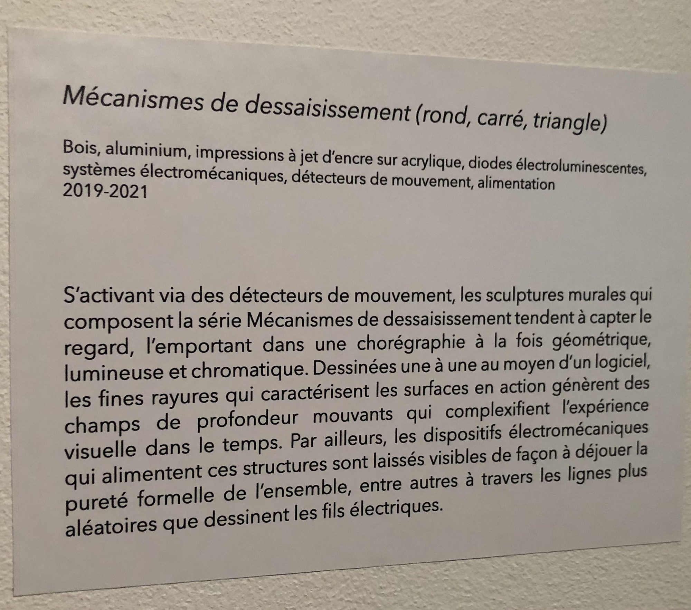
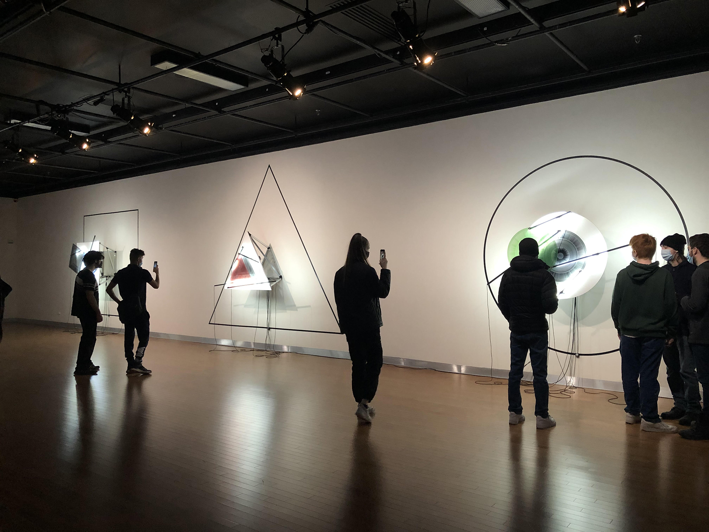
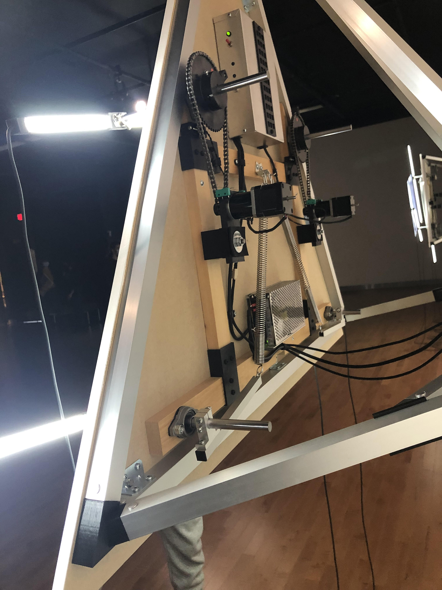
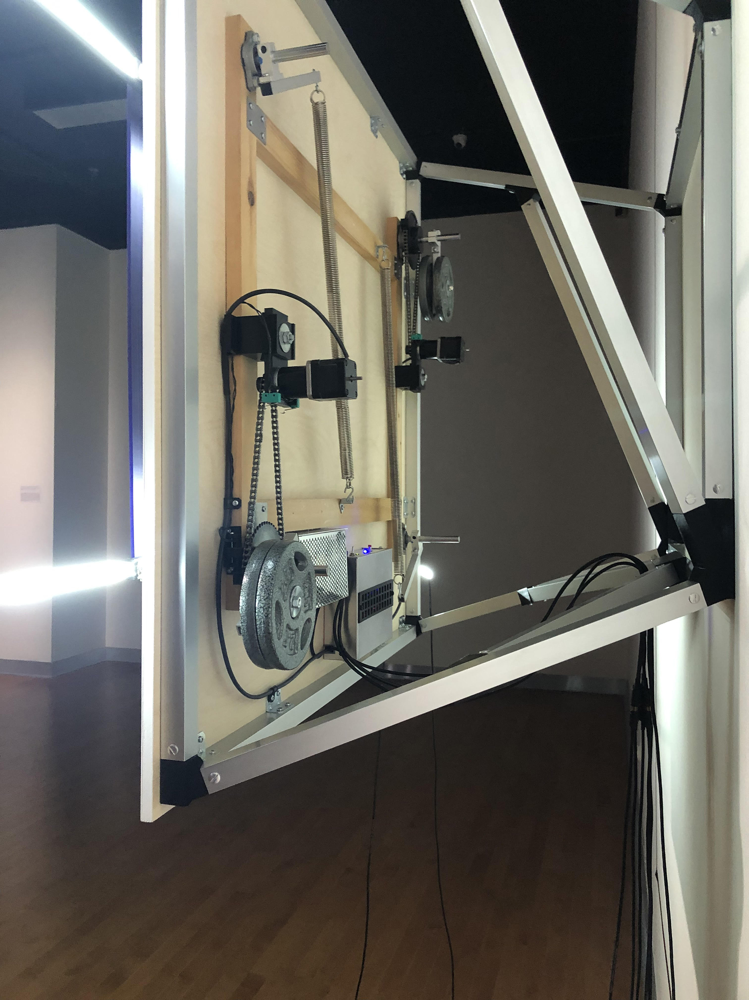
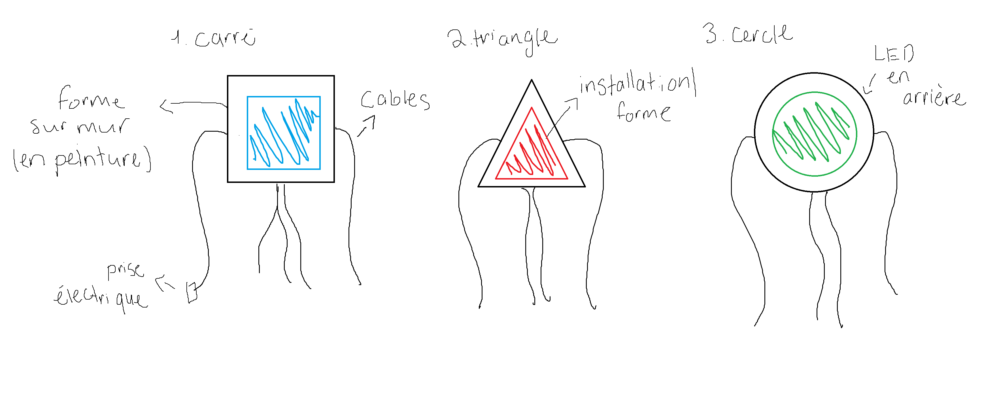
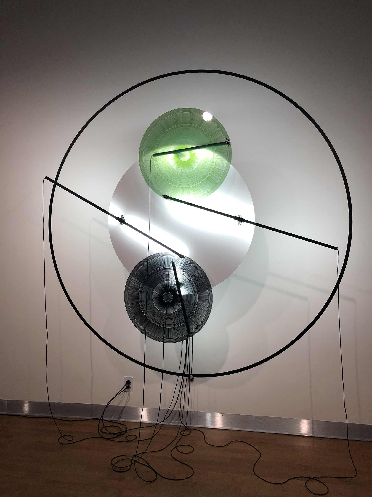
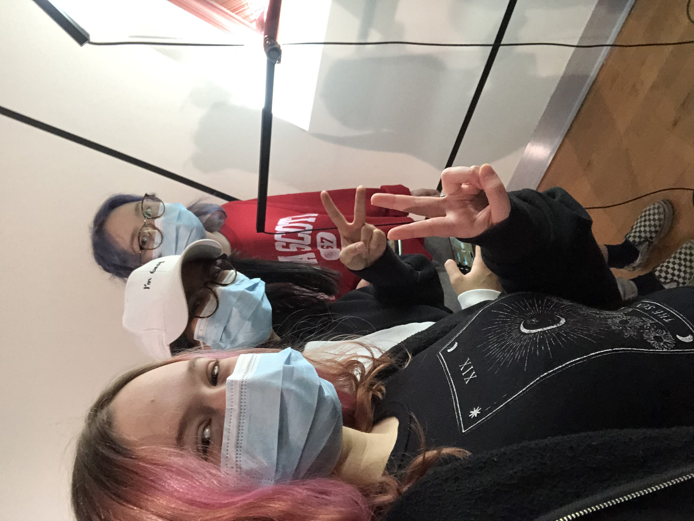

## TITRE DE L'OEUVRE
- Mécanismes de dessaisissement (rond, carré, triangle)
 
### NOM ARTISTE OU FIRME
- Catherine Béchard et Sabin Hudon

### ANNÉE DE RÉALISATION
- 2019 - 2021

### NOM DE L'EXPOSITION OU DE L'ÉVÉNEMENT
- Configurations du sensible

### LIEU DE MISE EN EXPOSITION
- Maison des arts de Laval

### DATE DE VOTRE VISITE 
 - 17 mars 2022

## DESCRIPTION
   
 (source: Cartel d'exposition de l'oeuvre par Catherine Béchard et Sabin Hudon)

### EXPLICATIONS
- Mécanismes de dessaisissement est une installation artistique muni de trois parties exposé cote a cote sur un mur blanc. L'installation représente trois formes géométriques (cercle, triangle, carré) illuminé par des lumières LED. Les structures font une rotation qui se déclenche en la présence de visiteurs ce qui crée par moments des illusions d'optiques. Des formes identiques à ceux présents dans les différents dispositifs sont peinturées en noir sur le mur derrière ceux-ci.
  

### LISTE DES COMPOSANTES ET TECHNIQUES
 - Structures en bois
 - Structures en aluminium
 - Impressions à jet d'encre sur acrylique
 - Diodes électroluminnescentes
 - Systèmes électromécaniques (pour la rotation)
 - Détecteurs de mouvement
 - Cables connecteurs
 - Cables d'alimentation
 (source: Cartel d'exposition de l'oeuvre par Catherine Béchard et Sabin Hudon)
  
  
  

### LISTE DES ÉLÉMENTS NÉCESSAIRES
 - Prises électriques
 - Structures en aluminium servant à l'accrochage des dispositifs
 - Peinture noire
  

## EXPÉRIENCE VÉCUE

**DESCRIPTION DE MON EXPÉRIENCE**
- Cette installation est celle qui a capté mon attention en premier du fait qu'elle est très bien illuminée. Malgré le fait qu'elle soit mise en exposition sur le côté de la salle (et non au milieu), elle prend beaucoup d'espace. Cette oeuvre est subtile, elle n'a pas d'élément particulièrement tape-à-l'oeil mais elle parvient à bien exprimer un sentiment paisible au visiteur. J'ai apprécié ce moment de relaxation à qui consistait à observer la lente rotation des formes. De plus, la trame sonore d'une autre oeuvre exposée dans la même salle complimentait bien ce sentiment de paix. 

 ❤️ **CE QUI M'A PLU**
- J'ai aimé l'utilisation de la lumière, je trouvais qu'il avait un bon équilibre d'intensité (ni trop fort, ni trop faible). D'ailleurs, je trouve que le contraste/reflet du mur blanc avec l'électroluminescence des diodes créait une jolie lueur qui découpait bien l'oeuvre du mur. Cela créait une profondeur ainsi que donnait l'effet que l'installation flottait.
- J'ai aimé la netteté de l'installation. Les couleurs, les textures et même l'organisation des câbles formaitent une harmonie qui démontrait d'un grand professionnalisme. C'est un aspect que je trouve important lors de la conception d'un oeuvre multimédia, c'est difficile d'apprécier un oeuvre qui à l'air amateur. 

 🤔 **ASPECT QUE JE SOUHAITE PAS RETENIR**
 - Je trouve que le manque d'une trame sonore personnifié est un point faible de l'installation, si cette oeuvre avait été mise en exposition dans une autre salle (sans les autres oeuvres), le silence aurait été un peu déconcertant. Je trouve que c'est important d'avoir une sonorisation bien exécutée dans n'importe quelle installation. C'est une couche d'immersion additionnelle qui rend une expérience absolument plus mémorable. 

**AUTOPORTRAIT**

 
